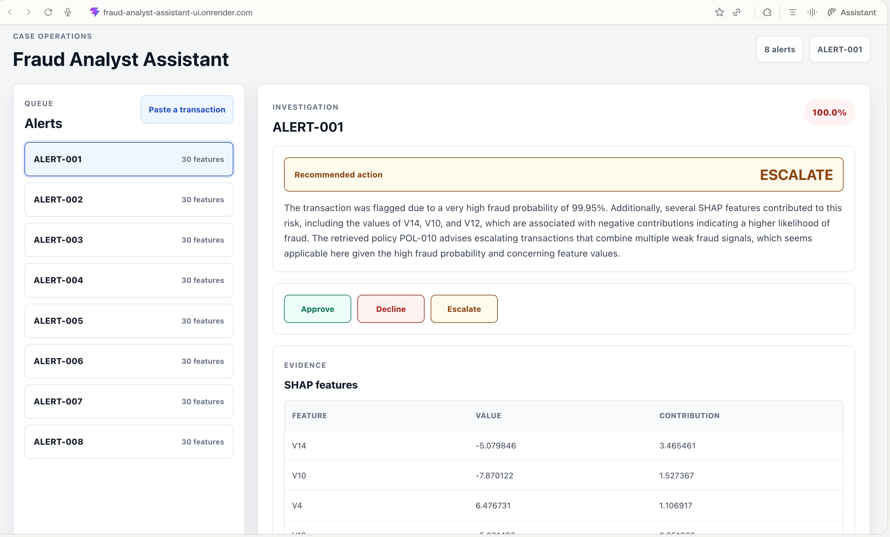
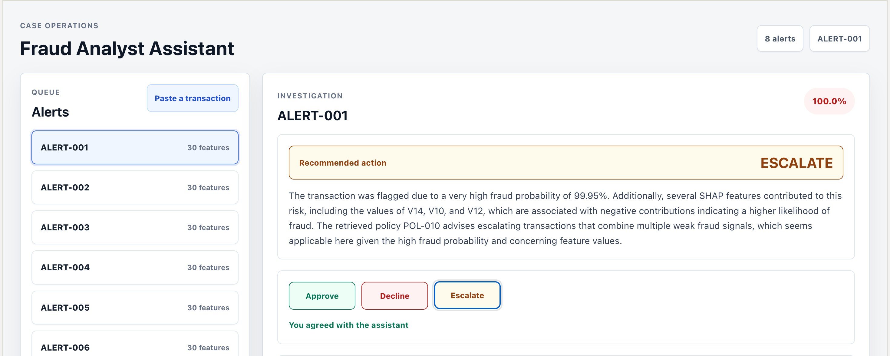
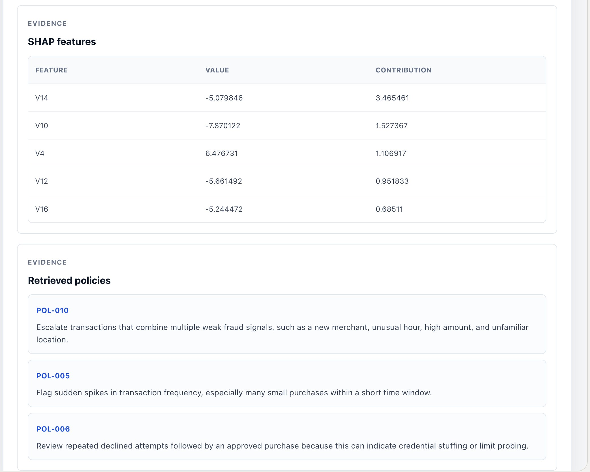

# Fraud Analyst Assistant

An AI assistant that triages credit-card fraud alerts — it scores each transaction, explains the risk in plain English, and recommends an action, turning a multi-minute manual investigation into a single-screen review.

**Live demo:** https://fraud-analyst-assistant-ui.onrender.com/
**Repo:** https://github.com/mani271deep/fraud-analyst-assistant



> Note: the backend runs on a free tier that sleeps after inactivity. The first alert you investigate may take 30–60 seconds while the server wakes up; subsequent requests are fast.

## The problem

Banks flag suspicious transactions automatically, but the software can't be trusted to block customers on its own, so every alert goes to a human fraud analyst who decides whether it's real fraud or a false alarm. That triage is slow and repetitive: the analyst manually gathers context — the customer's normal behavior, why the system flagged this, whether anything similar happened before — and most alerts turn out to be false alarms. The queue never empties, real fraud waits, and legitimate customers get blocked by mistake.

In short: investigating fraud alerts is slow, repetitive, and mostly spent on false positives.

## The solution

The Fraud Analyst Assistant sits next to the analyst and does the tedious part of the investigation. For each alert it:

1. **Scores** the transaction with a gradient-boosted model and returns a fraud probability.
2. **Explains** why it was flagged in plain English, grounded in the specific features that drove the score (via SHAP) and the relevant fraud-handling policies (retrieved from a vector store).
3. **Recommends** an action — APPROVE, DECLINE, or ESCALATE — with the evidence to back it up.

Instead of starting each alert from scratch, the analyst opens it and already sees a clear summary, a grounded reason, and a suggested decision to confirm or override.



## How it works

```
Transaction
   │
   ▼
XGBoost model  ──►  fraud probability + SHAP feature contributions
   │
   ▼
FAISS vector store  ──►  most relevant fraud-handling policies (semantic search)
   │
   ▼
LLM (OpenAI)  ──►  plain-English explanation + recommended action
                   (constrained to use ONLY the provided features and policies)
   │
   ▼
React dashboard  ──►  analyst reviews, confirms or overrides
```

The explanation layer is deliberately grounded: the language model is given the SHAP features and the retrieved policies and instructed to reference only those, never to invent a reason the model didn't actually use. This keeps the assistant's output auditable rather than a free-form chatbot guess. Every recommendation shows its evidence — the features that drove the score and the policies that were matched.



## Tech stack

- **Model:** XGBoost (gradient-boosted trees) trained on the [Credit Card Fraud Detection dataset](https://www.kaggle.com/datasets/mlg-ulb/creditcardfraud) (anonymized, real transactions)
- **Explainability:** SHAP feature contributions
- **Retrieval:** FAISS vector store over fraud-handling policy snippets, with OpenAI embeddings
- **Assistant:** OpenAI chat model, constrained to the retrieved evidence
- **API:** FastAPI (`/score` and `/investigate` endpoints)
- **Frontend:** React (Vite)
- **Deployment:** Render (backend Web Service + frontend Static Site)

## Repository structure

```
fraud-analyst-assistant/
├── backend/
│   ├── train_model.py          # train + save the XGBoost model
│   ├── build_index.py          # embed policies + build the FAISS index
│   ├── make_sample_alerts.py   # generate sample alerts for the dashboard
│   ├── app.py                  # FastAPI app: /score and /investigate
│   ├── assistant.py            # SHAP + retrieval + LLM orchestration
│   ├── knowledge/policies.json # fraud-handling policy snippets
│   └── model/                  # saved model + FAISS index + feature list
├── frontend/                   # React dashboard
├── screenshots/                # images used in this README
├── requirements.txt
└── README.md
```

## Running locally

**Prerequisites:** Python 3.12, Node.js, and the dataset (`creditcard.csv` from the link above) placed in a `data/` folder. You'll also need an OpenAI API key.

**Backend:**

```bash
pip install -r requirements.txt
export OPENAI_API_KEY=sk-...
python backend/train_model.py        # trains and saves the model
python backend/build_index.py        # builds the policy vector index
uvicorn backend.app:app --reload     # serves the API on :8000
```

**Frontend:**

```bash
cd frontend
npm install
npm run dev                          # serves the dashboard on :5173
```

The frontend automatically calls the local backend when run on localhost and the deployed backend otherwise.

## Engineering notes

A few real-world problems solved along the way, worth calling out because they reflect how this behaves in production rather than just in a notebook:

- **XGBoost model serialization across versions.** A model saved by one XGBoost version stored its `base_score` parameter as an array string (`'[5.0025505E-1]'`), which a different version couldn't parse on load. Pinning the version and setting an explicit scalar `base_score` resolved it.
- **Estimator-type error on deploy.** Loading the saved model into the sklearn `XGBClassifier` wrapper failed in the deployment environment with an `_estimator_type undefined` error. Loading the model as a raw `Booster` and computing SHAP contributions natively (`pred_contribs=True`, dropping the bias column) sidestepped the wrapper entirely and made the model load reliably across environments.
- **Grounded LLM output.** The assistant is constrained to explain using only the SHAP features and retrieved policies it's given, so explanations trace back to real model evidence instead of being free-form.

## Possible extensions

- Track agreement rate between the assistant's recommendation and the analyst's decision as an evaluation metric.
- Add a feedback loop so overridden recommendations inform future scoring.
- Replace anonymized features with human-readable ones for richer explanations.
